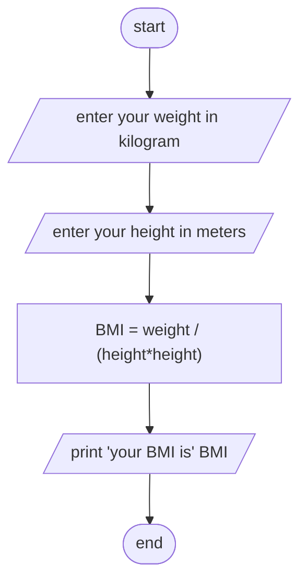

Analysis 

Input:- height, weight
Output:- BMI
Process:- BMI = weight/ ( height * height )

Algorithm in Pseudocode

Step1; start
Step2; read height and weight
Step3; comput BMI = weight/ ( height * height )
Step4; print BMI
Step5; end

Algorithm in flowchart:

#Flowchart

