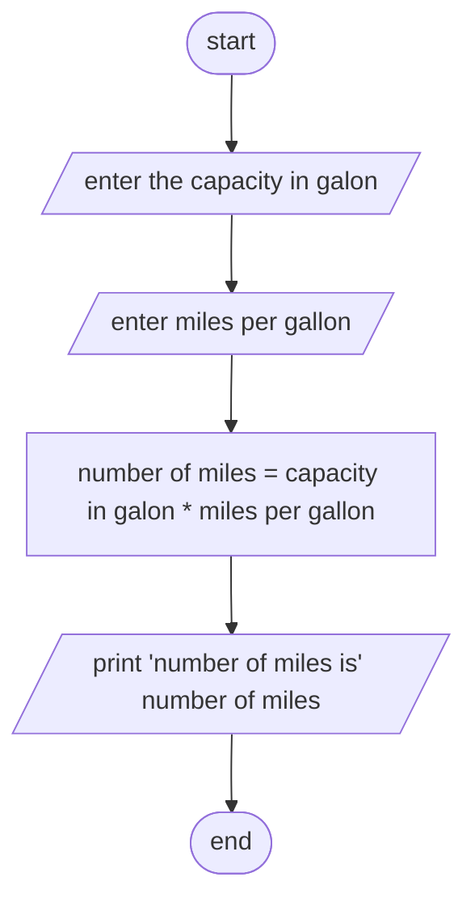

Analysis 

Input:- capacity in gallons(c), miles per gallons(mpg) 
Output:- number of miles  you can drive without refueling
Process:- number of miles you can drive without refueling = capacity in gallons * miles per gallons 

Algorithm in Pseudocode

Step1; start
Step2; read capacity in gallons and miles per gallons 
Step3; Comput  number of miles you can drive without refueling = capacity in gallons * miles per gallons 
Step4; print number of miles you can drive without refueling
Step5; end
Algorithm in flowchart :
#Flowchart

