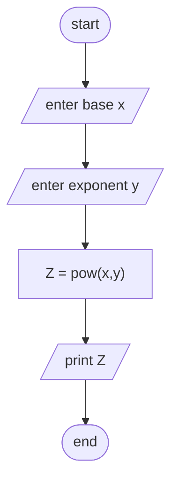

Analysis 

Input:- the base number (X) and the exponent number (Y)

Output:- print the result number of X the power of Y

Process:- Comput  X the power of Y

Algorithm in Pseudocode

Step1; start

Step2; input the base X and the exponent Y which are a set of real numbers 

Step3; Comput Z = X^Y

Step4; print the computed value 

Step5; end

Algorithm in flowchart

#Flowchart

