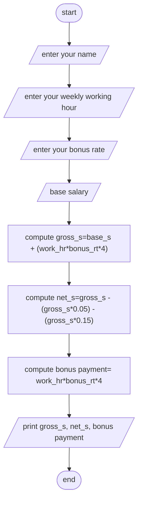

Analysis 

Input:- employee name, weekly working hours, bonus rate per hour and base salary

Output:- employee name,  gross-salary, net salary and bonus payment

Process:-  Comput gross-salary = base salary + (bonus rate * working hours * 4), net salary = gross salary – gross salary(pension Rate) – gross salary(tax rate) and bonus payment = bonus rate * working hours

Algorithm in Pseudocode

Step1; start

Step2; read employee name, weekly working hours, bonus rate per hour and base salary

Step3; Comput gross-salary = base salary + (bonus rate * working hours * 4)

Step4; Comput net salary = gross salary – gross salary(pension Rate) – gross salary(tax rate) 

Step5; Comput bonus payment = bonus rate * working hours

Step6; print employee name

Step7; print gross-salary

Step8; print net salary

Step9; print bonus payment

Step10; end

Algorithm ini flowchart 

#Flowchart

