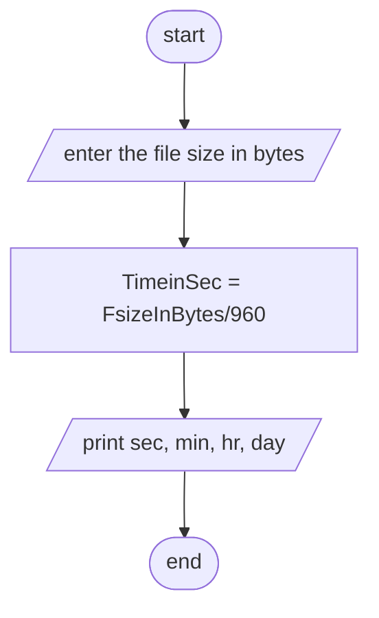

Analysis 

Input:- file size in bytes 

Output:- how long it will take/ the time it takes to send a file in seconds

Process:- the time it takes to send a file = file size in bytes/ 960

Algorithm in Pseudocode

Step1; start

Step2; read file size in bytes 

Step3; Comput time in seconds = file size in bytes/ 960

Step4; print time in seconds

Step5; end

Algorithm in flowchart
#Flowchart

