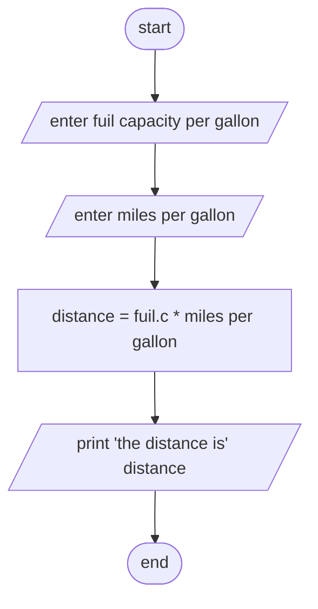

Analysis 
input: fuel capacity (cp), mile per gallon(mpg)
output: maximum distance with one full fule (m)
Process: m = cp*mpg

Algorithm in psudocode
step 1: start
step 2: read fuel capacity (cp), mile per gallon (mpg)
step 3: calculate m = cp*mpg
step 4: print m
step 5: end

Algorithm in flowchart :
#Flowchart

