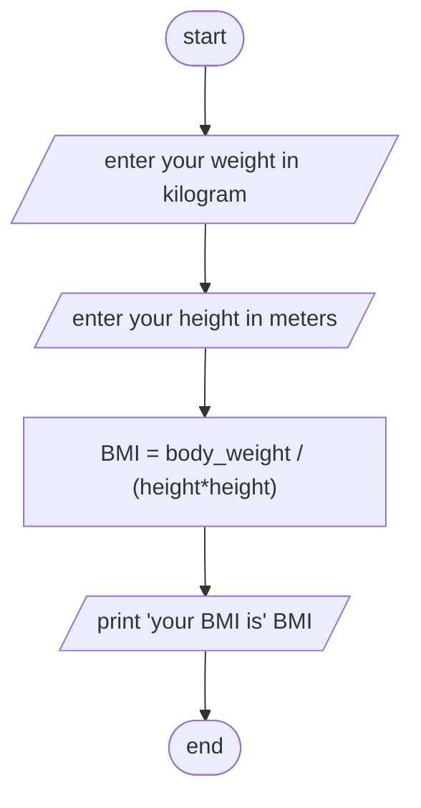

Analysis 
input: height and weight
output: body mass index
process: weight divided by height squared 

Algorithm in psudocode:
step 1: start
step 2: input height, width 
step 3: calculate height square = height*height 
step 4: calculate BMI = weight divided by height squared
step 5: print BMI
step 6: end

Algorithm in flowchart:

#Flowchart

