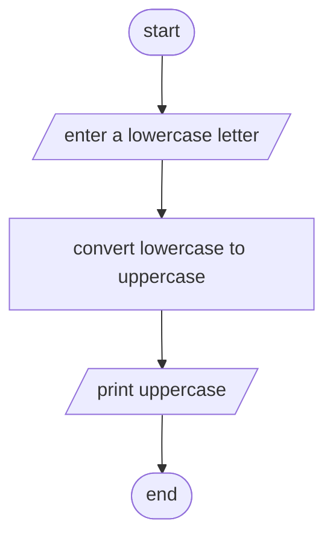

Analysis 
input: lowercase letter or character 
output: uppercase of the inputed letter
operation: change from lowercase to uppercase / letter = toupper(letter)

Algorithm design (pseudocode):
step 1: start
step 2: read a lowercase character from keyboard 
step 3: change the lowercase character to its uppercase character 
step 4: print the uppercase character 
step 5: end

Algorithm in flowchart 

#Flowchart

