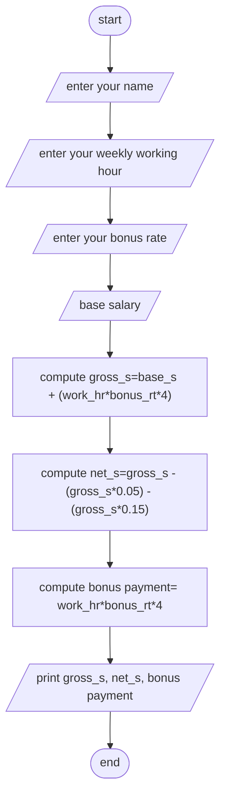

Analysis 
input : file size in bytes 
output : time it takes to transfer the file
process : second = data/960, minuit = second/60 = data/57600, hour = minuit/60 = data/3456000, day = hour/24 = data/82944000

algorithm in psudocode:
step 1: start 
step 2: input file size in bytes 
step 3: calculate second = data/960
step 4: calculate minuit =data/57600
step 5: calculate hour =data/3456000
step 6: calculate day =  data/82944000
step 7: print second, minuit, hour, day
step 8: end 

Algorithm in flowchart

#Flowchart

