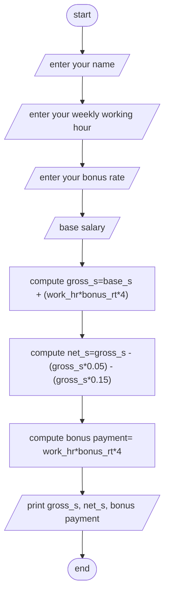

Analysis:
inpust: employee name, weekly working hour, bonus rate, base salary
output:gross salary, net salary, bonus payment 
operation: gross salary = base salary + (weekly working hour* bonus rate*4)
          net salary = gross salary - (gross salary*0.05)-(gross salary*0.15)
          bonus payment = weekly working hour*bonus rate*4

Algorithm desig(psudocode)
step 1:start 
step 2:read employee name, weekly work hour, bonus rate, base salary
step 3:compute  gross salary = base salary + (weekly working hour* bonus rate*4)
          net salary = gross salary - (gross salary*0.05)-(gross salary*0.15)
          bonus payment = weekly working hour*bonus rate*4

step 4:print gross salary, net salary, bonus payment 
step 5:end 

Algorithm ini flowchart 

#Flowchart

